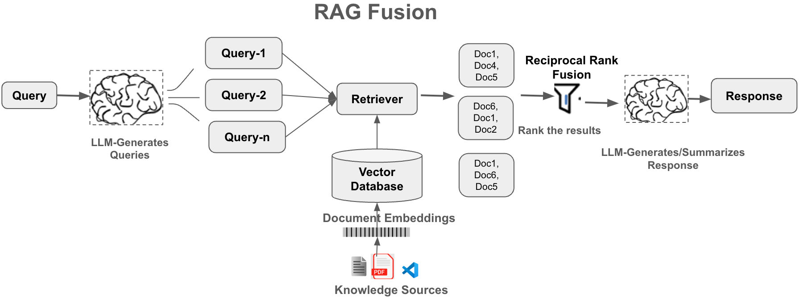

## RAG Fusion Implementation

In our implemented RAG Fusion pipeline, a user query is first decomposed into multiple focused subqueries to capture different aspects of the original question. Each subquery is embedded using a query embedding model and sent together in a batch search to the FAISS vector index for efficient similarity retrieval. Instead of treating each retrieval independently, the results from all subqueries are combined and ranked using a fusion strategy (such as Reciprocal Rank Fusion). This fusion step aggregates rankings across queries, promotes documents that consistently appear near the top, and reduces noise from isolated matches. The final output is a deduplicated, relevance-optimized set of top documents that are then passed to the LLM for answer generation. This approach improves coverage, robustness, and answer quality compared to single-query retrieval, while maintaining efficient batch vector search performance.